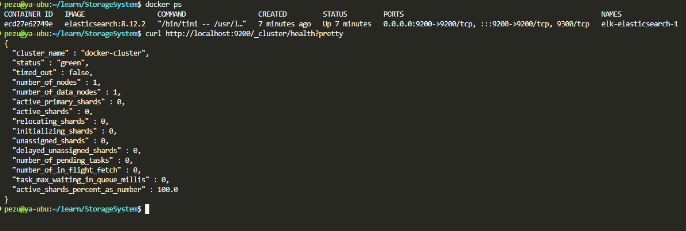
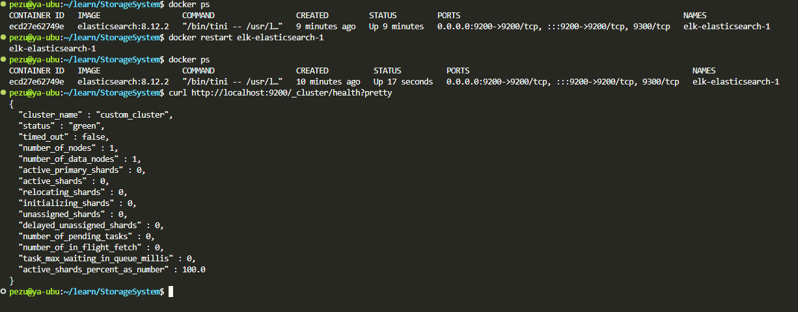
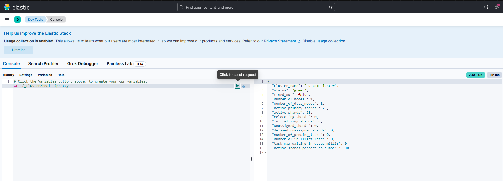
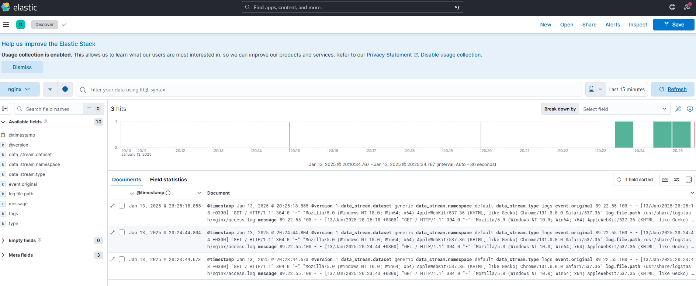
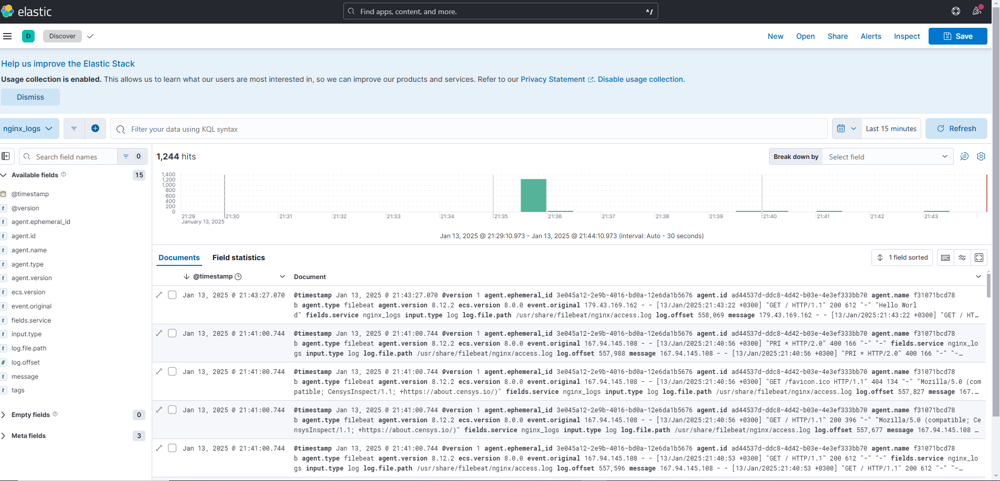

# ELK.

### Задание 1. Elasticsearch

___Установите и запустите Elasticsearch, после чего поменяйте параметр cluster_name на случайный. Приведите скриншот команды 'curl -X GET 'localhost:9200/_cluster/health?pretty', сделанной на сервере с установленным Elasticsearch. Где будет виден нестандартный cluster_name.___

Docker

cluster_name=docker-cluster



```bash
docker exec -it elk-elasticsearch-1 /bin/bash
nano config/elasticsearch.yml
```

```
cluster.name: "custom_cluster"
```




### Задание 2. Kibana

___Установите и запустите Kibana. Приведите скриншот интерфейса Kibana на странице http://<ip вашего сервера>:5601/app/dev_tools#/console, где будет выполнен запрос GET /_cluster/health?pretty.___




### Задание 3. Logstash.




### Задание 4. Filebeat.

